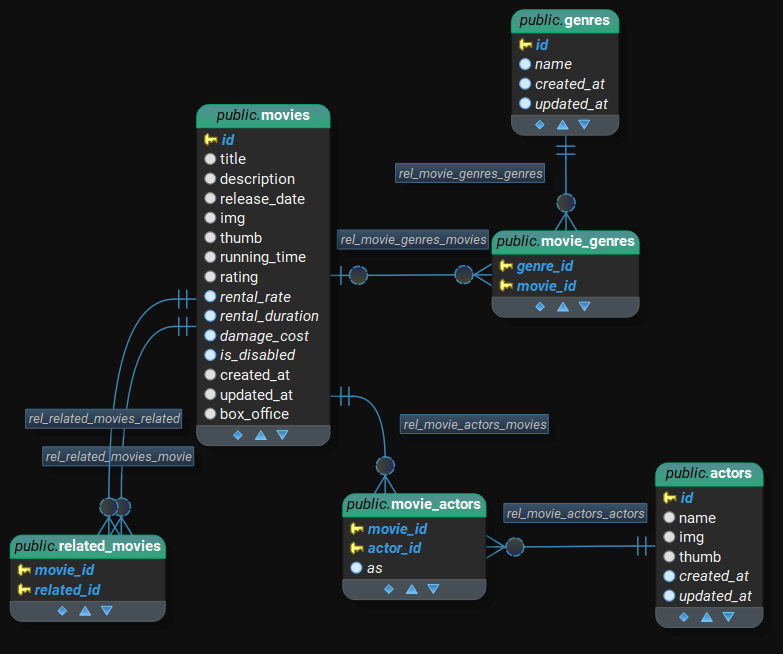

# Summer Internship

---

## Chapter 4: Dataset

filler data for project from [IMDB](https://www.imdb.com/chart/top/) using [OMDB](http://www.omdbapi.com/) api 

data set files are included inside `private` directory in project root

- `movies.zip`: the content of `public/uploads/movies`
- `movies.ts`: movie data

---

#### packages introduced this chapter

- `npm install --save uuid`
- `npm install --save-dev @types/uuid`

---

### Initial design:

the following diagram is the current goal data structure 

movies table already has a migration, in order to reach the goal state:

- add `genres` table 
- add `actors` table
- add `movie_genres` table relating `movies` to `genres`
- add `movie_actors` table relating `movies` to `actors`
- add `related_movies` table relating `movies` to other `movies`

few things to note:
- `genres` `name` attribute is set to `jsonb` type in order to store multilingual values in json format
- `movie_genres` and `related_movies` are relation tables using `foreign keys` 
- `movie_actors` table is a relation table with an extra `as` attribute refers to the `actor` name in the `movie`
- table `movies` has a new column `box_office` not present in the initial migration

---

### Migrate and Seed Dataset

the different ways of seeding data are reflected in the Seeder files:

- [GenreSeeder](./Database/Seeders/20220803083920_GenreSeeder.ts) uses raw sql syntax
- [ActorSeeder](./Database/Seeders/20220803084446_ActorSeeder.ts) uses knex insert, and updates the sequence of incremental id
- [MovieSeeder](./Database/Seeders/20220803085413_MovieSeeder.ts) breaks data into 3 tables `movies`with its relations `genres` and `actors`
- [CastAsSeeder](./Database/Seeders/20220803202059_CastAsSeeder.ts) and [RelatedMoviesSeeder](./Database/Seeders/20220803211405_RelatedMoviesSeeder.ts) depend on `movies` and `actors` to be pre-seeded

with all seeds available and in order run:

- `knex migrate:latest`
- `knex seed:run`

the basic structure is ready with actual information, in the next chapter we'll take a look `objection.js` orm and how to make controllers that retrieve and manipulate data
